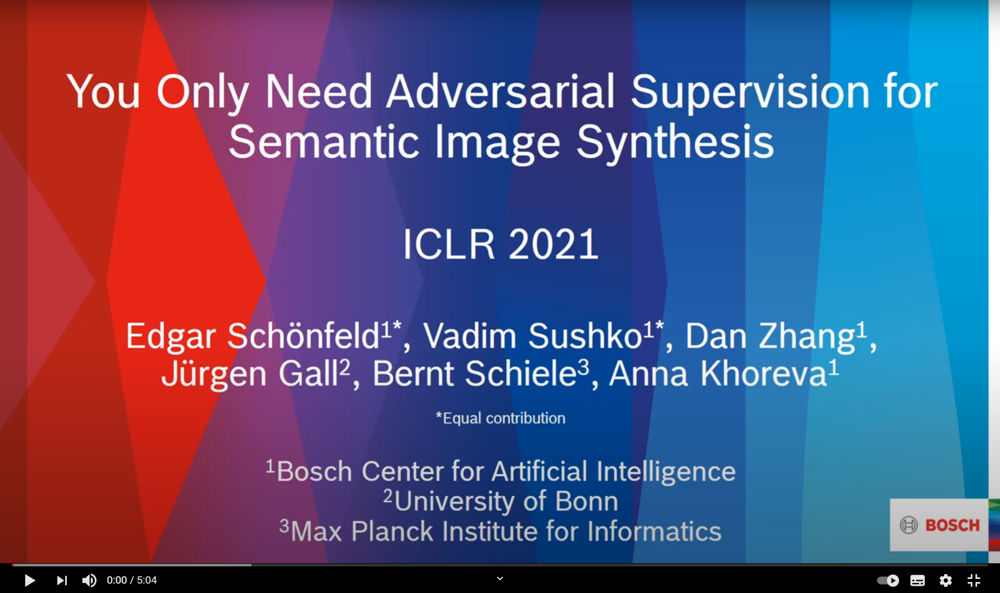

# You Only Need Adversarial Supervision for Semantic Image Synthesis

Official PyTorch implementation of the ICLR 2021 paper "You Only Need Adversarial Supervision for Semantic Image Synthesis". The code allows the users to
reproduce and extend the results reported in the study. Please cite the paper when reporting, reproducing or extending the results.

[[OpenReview](https://openreview.net/forum?id=yvQKLaqNE6M)]  [[Arxiv](https://arxiv.org/abs/2012.04781)]  [[5min Video Summary](https://www.youtube.com/watch?v=vUm6vurIwyM)]  

# Overview

This repository implements the OASIS model, which generates realistic looking images from semantic label maps. In addition, many different images can be generated from any given label map by simply resampling a noise vector (first two rows of the figure below). The model also allows to just resample parts of the image (see the last two rows of the figure below). Check out the paper for details, as well as the appendix, which contains many additional examples.


<p align="center">

</p>


## Setup
First, clone this repository:
```
git clone https://github.com/boschresearch/OASIS.git
cd OASIS
```

The code is tested for Python 3.7.6 and the packages listed in [oasis.yml](oasis.yml).
The basic requirements are PyTorch and Torchvision.
The easiest way to get going is to install the oasis conda environment via
```
conda env create --file oasis.yml
source activate oasis
```
## Datasets

For COCO-Stuff, Cityscapes or ADE20K, please follow the instructions for the dataset preparation as outlined in [https://github.com/NVlabs/SPADE](https://github.com/NVlabs/SPADE).

## Training the model

To train the model, execute the training scripts in the ```scripts``` folder. In these scripts you first need to specify the path to the data folder. Via the ```--name``` parameter the experiment can be given a unique identifier. The experimental results are then saved in the folder ```./checkpoints```, where a new folder for each run is created with the specified experiment name. You can also specify another folder for the checkpoints using the ```--checkpoints_dir``` parameter.
If you want to continue training, start the respective script with the ```--continue_train``` flag. Have a look at ```config.py``` for other options you can specify.  
Training on 4 NVIDIA Tesla V100 (32GB) is recommended. Tip: For significantly faster training, set the ``num_workers`` parameter of the dataloader to a higher number, e.g. 8 (the default is 0).

## Testing the model

To test a trained model, execute the testing scripts in the ```scripts``` folder. The ```--name``` parameter should correspond to the experiment name that you want to test, and the ```--checkpoints_dir``` should the folder where the experiment is saved (default: ```./checkpoints```). These scripts will generate images from a pretrained model in ```./results/name/```.

## Measuring FID

The FID is computed on the fly during training, using the popular PyTorch FID implementation from https://github.com/mseitzer/pytorch-fid. At the beginning of training, the inception moments of the real images are computed before the actual training loop starts. How frequently the FID should be evaluated is controlled via the parameter ```--freq_fid```, which is set to 5000 steps by default. The inception net that is used for FID computation automatically downloads a pre-trained inception net checkpoint. If that automatic download fails, for instance because your server has restricted internet access, get the checkpoint named ```pt_inception-2015-12-05-6726825d.pth``` from [here](https://www.dropbox.com/sh/nf6of02pyk84zjg/AAC8hnnj0T_MAiPx3tzdAyiWa?dl=0) and place it in ```/utils/fid_folder/```. In this case, do not forget to replace ```load_state_dict_from_url``` function accordingly.

## Pretrained models

The checkpoints for the pre-trained models are available [here](https://www.dropbox.com/sh/nf6of02pyk84zjg/AAC8hnnj0T_MAiPx3tzdAyiWa?dl=0) as zip files. Copy them into the checkpoints folder (the default is ```./checkpoints```, create it if it doesn't yet exist) and unzip them. The folder structure should be  
```
checkpoints_dir
├── oasis_ade20k_pretrained                   
├── oasis_cityscapes_pretrained  
└── oasis_coco_pretrained
```

You can generate images with a pre-trained checkpoint via ```test.py```. Using the example of ADE20K:
```
python test.py --dataset_mode ade20k --name oasis_ade20k_pretrained \
--dataroot path_to/ADEChallenge2016
```
This script will create a folder named ```./results``` in which the resulting images are saved.

If you want to continue training from this checkpoint, use ```train.py``` with the same ```--name``` parameter and add ```--continue_train --which_iter best```.

# Additional information

## Poster

<p align="center">

</p>


## Video Summary
[](https://www.youtube.com/watch?v=vUm6vurIwyM)

## Citation
If you use this work please cite
```
@inproceedings{
sch{\"o}nfeld2021you,
title={You Only Need Adversarial Supervision for Semantic Image Synthesis},
author={Edgar Sch{\"o}nfeld and Vadim Sushko and Dan Zhang and Juergen Gall and Bernt Schiele and Anna Khoreva},
booktitle={International Conference on Learning Representations},
year={2021},
url={https://openreview.net/forum?id=yvQKLaqNE6M}
}
```

## License

This project is open-sourced under the AGPL-3.0 license. See the
[LICENSE](LICENSE) file for details.

For a list of other open source components included in this project, see the
file [3rd-party-licenses.txt](3rd-party-licenses.txt).

## Purpose of the project

This software is a research prototype, solely developed for and published as
part of the publication cited above. It will neither be
maintained nor monitored in any way.

## Contact
Please feel free to open an issue or contact us personally if you have questions, need help, or need explanations.
Write to one of the following email addresses, and maybe put one other in the cc:

edgarschoenfeld@live.de  
vad221@gmail.com  
edgar.schoenfeld@bosch.com  
vadim.sushko@bosch.com  
